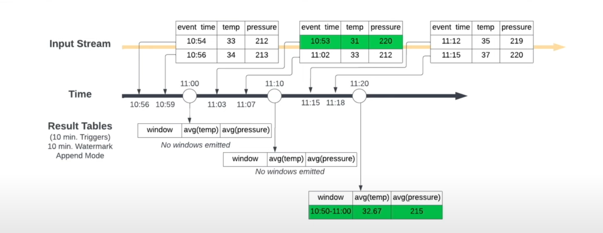

# Project Overview
Welcome to the "Real-Time Streaming with Azure Databricks" repository. This project demonstrates an end-to-end solution for real-time data streaming and analysis using Azure Databricks and Azure Event Hubs, with visualization in Power BI. It's an in-depth guide covering the setup, configuration, and implementation of a streaming data pipeline following the medallion architecture.

## Repository Contents
- `Real-time Data Processing with Azure Databricks (and Event Hubs).ipynb`: The Databricks notebook used for data processing at each layer of the medallion architecture.
- `data.txt`: Contains sample data and JSON structures for streaming simulation.
- `Azure Solution Architecture.png`: High level solution architecture.

## Project content : Real-time Data Processing with Azure Databricks (and Event Hubs)

This notebook demonstrates the below architecture to build real-time data pipelines.
<h3>
  
</h3>

- Data Sources: Streaming data from IoT devices or social media feeds. (Simulated in Event Hubs)
- Ingestion: Azure Event Hubs for capturing real-time data.
- Processing: Azure Databricks for stream processing using Structured Streaming.
- Storage: Processed data stored Azure Data Lake (Delta Format).
- Visualisation: Data visualized using Power BI.

### Azure Services
- Databricks Workspace (Unity Catalog enabled)
- Azure Data Lake Storage (Premium)
- Azure Event Hub (Basic Tier)

### Azure Databricks Configuration Required
- Single Node Compute Cluster: `12.2 LTS (includes Apache Spark 3.3.2, Scala 2.12)`
- Maven Library installed on Compute Cluster: `com.microsoft.azure:azure-eventhubs-spark_2.12:2.3.22`

### Medallion architecture
- The 'weather' table in the 'bronze' schema of the 'streaming' catalog contains data related to weather events. It includes information such as the body of the event, the partition and offset values, the sequence number, the time the event was enqueued, the publisher, the partition key, and various properties and system properties associated with the event.
- In the gold layer, I create a streaming aggregate table with a watermark and a window of 5 min
<h3>
  
</h3>
